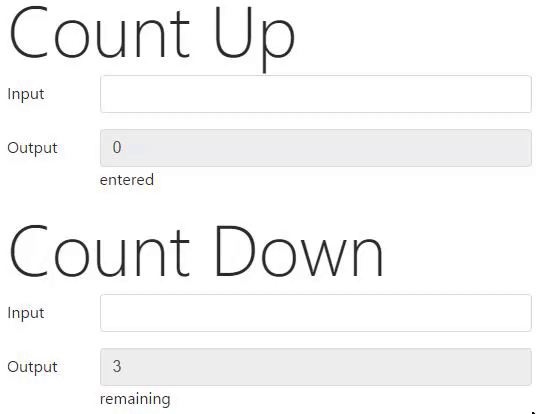

## JavaScriptCharacterCount

> An amazingly small, dependency-less utility for counting input characters. Less than 1 Kbyte!

[](#)

### Download

```bash
# Get it with npm ...
$ npm i javascript-character-count
```

### Usage

#### Count Up

```html
<form>
    <fieldset>
        <label for="count-characters">Enter Text ...</label>
        <input id="count-characters">
    </fieldset>

    <fieldset>
        <label for="count-characters-result">Element contains
        <input type="text" id="count-characters-result" readonly>
        characters.
    </fieldset>
</form>

<script>
  // Pass input element as first argument.
  // with jquery: $('#count-characters');
  // Options array as second argument.
  characterCount(document.getElementById('count-characters'), {
    max: 3, // the maximum input length (use for ux or callback)
    // Pass output element to the output key.
    output: document.getElementById('count-characters-result')
  });
</script>
```

#### Count Down

```html
<form>
    <fieldset>
        <label for="count-characters">Enter Text ...</label>
        <input id="count-characters">
    </fieldset>

    <fieldset>
        <label for="count-characters-result">Element can contain up to
        <input type="text" id="count-characters-result" readonly>
        more characters.
    </fieldset>
</form>

<script>
  // Pass input element as first argument.
  // with jquery: $('#count-characters');
  // Options array as second argument.
  characterCount(document.getElementById('count-characters'), {
    max: 3, // the maximum input length (use for ux or callback)
    // Pass output element to the output key.
    output: document.getElementById('count-characters-result')
  },
  null // Callback in the third argument - here null
  true // Invert counting? E.g counting down?
  );
</script>
```
> See 'examples' for a real life example.

### CDN

For Development: [https://rawgit.com/PascaleBeier/JavaScriptCharacterCount/2.0.0/dist/javascript-character-count.min.js](https://rawgit.com/PascaleBeier/JavaScriptCharacterCount/2.0.0/dist/javascript-character-count.min.js)

For Production: [https://cdn.rawgit.com/PascaleBeier/JavaScriptCharacterCount/2.0.0/dist/javascript-character-count.min.js](https://cdn.rawgit.com/PascaleBeier/JavaScriptCharacterCount/2.0.0/dist/javascript-character-count.min.js)

### Download

Downloads can be found [at the Releases Page](https://github.com/PascaleBeier/JavaScriptCharacterCount/releases).

### API

```javascript
  characterCount(element <element>, array <options>, callback <function> = null, boolean <invert> = false);
```

### Options

The array passed as second argument:

```javascript
{
  max: 255 // int, required. The callback is fired after this number is reached (or subtracted to 0 with invert = true)
  output: document.querySelector('div.outputElement'), // element, required
}
```

### Callbacks

Most of the time, you will want something to happen when a user enters a certain number of characters.
You can realize this with callbacks. If you want a simple `alert()` to popup, you can do:

```html
<form>
    <fieldset>
        <label for="count-characters">Enter Text ...</label>
        <input id="count-characters">
    </fieldset>

    <fieldset>
        <label for="count-characters-result">Element contains
        <input type="text" id="count-characters-result" readonly>
        characters.
    </fieldset>
</form>

<script>
  // Pass input element as first argument.
  // with jquery: $('#count-characters');
  // Options array as second argument.
  characterCount(document.getElementById('count-characters'), {
    max: 3, // the maximum input length (use for ux or callback)
    // Pass output element to the output key.
    output: document.getElementById('count-characters-result')
  },
  // Passing the callback function as third parameter.
  function () {
    alert('You entered the maximum number of characters');
  });
</script>
```


### Changelog

See [CHANGELOG](CHANGELOG.md)

### Contributing - Development Setup

```bash
# Get the source
$ git clone https://github.com/PascaleBeier/JavaScriptCharacterCount
$ cd JavaScriptCharacterCount
# Install devDependencies
$ npm i
# Compile src/ to dist/
$ npm run dev
# Build for publishing
$ npm run build
```

start editing src/javascript-character-count.js and open up examples/index.html in your browser.


### License

The MIT License.
